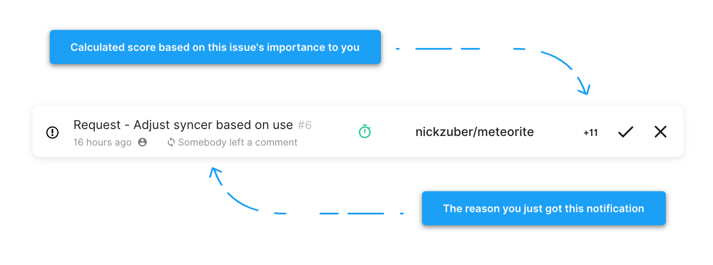

  
  <h1>meteorite</h1>
  <h3>https://meteorite.surge.sh/</h3>
  
✨ Smarter GitHub notifications 🌱

## Getting started

Just visit https://meteorite.surge.sh, log in, and let the notifications roll in as they happen!

## How it works

It's actually pretty simple - we use GitHub's notifications API to get your notifications as they come in, and keep track of relevant heuristics overtime on a per-thread basis, so we know _why_ you're getting a notification and the previous reason's you've gotten it.

Using this information, we're able to give a score of importantce to each thread based on the history of reasons we saw coming in. For example, a pull request that is assigned to you, has your review requested, and has 30 comments on it, will be scored much higher than an issue you opened up and received a single comment of someone saying "nice" on it.

We're also able to hook into desktop notifications to alert you when you get a GitHub notification if you'd want - something like this is totally opt-in.

Some key features include:

 - Scores your notifications based on their importance, so we can surface the most critical updates at the top of your queue.
 - Provides you with quick context for why you're receiving each notification.
 - Allows you to opt in for desktop notifications whenever you recieve important update to help notify you right away.
 - Protects you from useless spammy notifications that you don't care about.
 - Let's you focus in on specific types of notifications that matter to you, like when your review is requested for a pull request or you were assigned an issue.
 - Unlocks dope statistics that help you understand how you interact with notifications on a daily basis.

  

We're also able to categorize some types of notifications and put a badge on them to help you quickly identify different kinds of issues. We support:

 - Old pull requests that require your review (icon is a green clock).
 - Very active threads that get a lot of updates in a short amount of time (icon is a red flame).
 - Threads that have a lot of comments and conversation on them (icon is a blue word bubble).

## About this project

 - This project is currently hosted on [Surge](https://surge.sh/)
 - Built from an ejected [CRA](https://github.com/facebook/create-react-app) app
 - Authenticates with the help of [Gatekeeper](https://github.com/prose/gatekeeper)

# Contributing

All contributions are welcome, even if its just submitting feedback, giving a suggestion, or reporting a bug. If you're looking to add a feature to Meteorite, make sure you open an issue first (if there's not one open already), and make it known that you're going to be working on it as to avoid multiple people trying to pick up the same issue.

## License

This software is free to use under the MIT License. See [this reference](https://opensource.org/licenses/MIT) for license text and copyright information.
